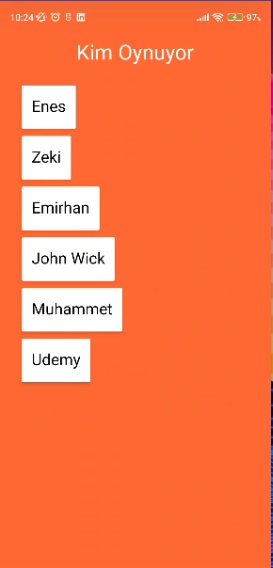

# MemoryGame

This is a Card Match Game

## Tech Stack

- Android Studio
- Kotlin
- Firebase

## Description

In this game, you earn points by matching the face down cards and the points you earn are written on the score table.

# Images

## Splash Screen

## Main Activity

## Register Activity

## Players Activity

